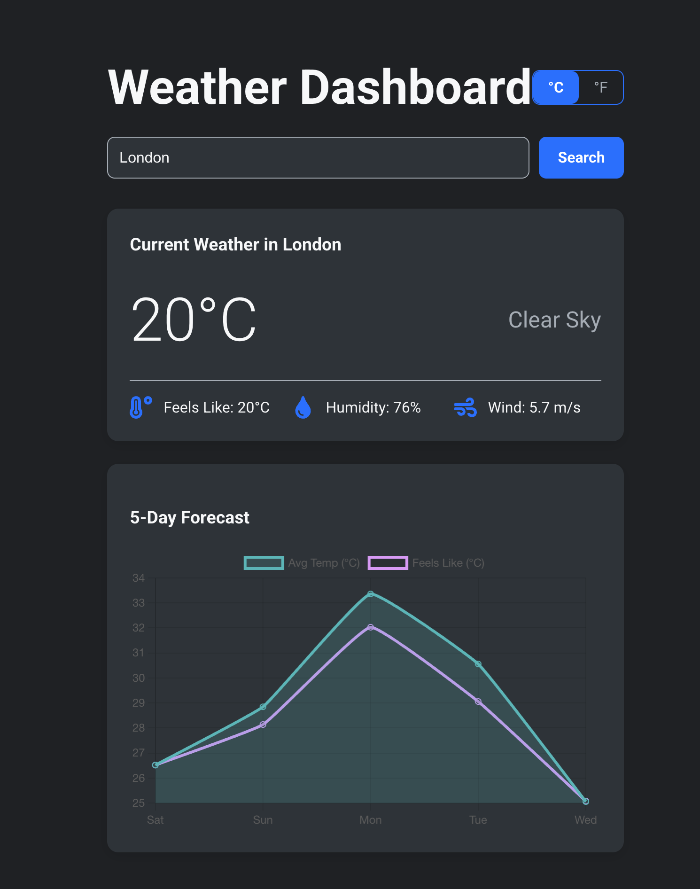

# 🌦️ React Weather Dashboard

A clean, responsive, and modern single-page application that provides real-time weather data for cities around the world. This project was built from the ground up to demonstrate a strong command of modern frontend development, API integration, and user experience design.



---

## 🧠 About The Project

This application provides users with an intuitive and visually appealing way to get current weather conditions and a 5-day forecast. It fetches live data from the OpenWeatherMap API and presents it through a dynamic and interactive user interface.

The project emphasizes a polished user experience, featuring:

- 🔍 Dynamic city search
- 🌡️ Temperature unit toggle (Celsius ↔ Fahrenheit)
- 🦴 Skeleton UI loading states
- 🎞️ Fade-in animations for smooth transitions

---

## 🔑 Key Features

- **Live API Integration** – Connects with OpenWeatherMap’s REST API to fetch current and forecast data.
- **Interactive Data Visualization** – Charts built with `Chart.js` via `react-chartjs-2` for a smooth and responsive forecast display.
- **State Management** – Built with **React** and **TypeScript** using hooks to manage user input, API state, and theme preferences.
- **Professional UX/UI**:
  - ✅ Unit toggle (Celsius/Fahrenheit)
  - ✅ Skeleton loaders
  - ✅ Responsive layout for desktop and mobile

---

## 🧰 Built With

- **Frontend**: React, TypeScript, Vite
- **Data Fetching**: Axios
- **Charting**: Chart.js + react-chartjs-2
- **Styling**: CSS3
- **Deployment**: Netlify

---

## 🚀 Getting Started

### Prerequisites

- Node.js v20+ and npm must be installed.

### Installation & Setup

```bash
# Clone the repo
git clone https://github.com/your_username/your_repository_name.git

# Navigate to project folder
cd weather-dashboard

# Install dependencies
npm install
```

### Environment Variable Setup

Create a `.env.local` file in the root directory with the following line (replace with your actual API key):

```bash
VITE_OPENWEATHERMAP_API_KEY=your_actual_api_key_goes_here
```

---

## 💻 Running the App Locally

```bash
npm run dev
```

Navigate to [http://localhost:5173](http://localhost:5173) (or the URL shown in your terminal) to view it in your browser.

---

## 📡 Acknowledgments

- **Weather API**: [OpenWeatherMap](https://openweathermap.org/api)
- **Dev Environment**: [Vite](https://vitejs.dev/)
